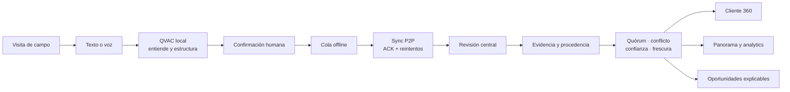

# QUÓRUM

> **La verdad tiene quórum.**

Un testigo no es la verdad. La verdad es lo que varios testigos independientes sostienen.
**El modelo entiende lo que vio cada persona. El sistema decide qué podemos creer. El humano confirma.**

Reto corporativo *Customer Installed Base Intelligence* (Philips) · Decentralized AI Hackathon · ISD Summit, Ciudad de Panamá · Equipo **Syzygy**.

Requisito duro del reto: inferencia on-device o delegada P2P con QVAC. **Ninguna inferencia en la nube.** QUÓRUM lo cumple y lo verifica con un script automático (`7/7 controles en verde`).

---

## La respuesta al challenge, en una frase

**QUÓRUM convierte lo que una persona observa durante una visita en evidencia estructurada y sincronizable; después reúne testimonios independientes para construir una visión viva de la base instalada, sin presentar incertidumbre o contradicciones como hechos.**

El reto pregunta cómo transformar observaciones de campo en visibilidad estructurada, confiable y accionable. Nuestra respuesta separa deliberadamente tres responsabilidades:

- **El móvil captura:** funciona en campo, acepta texto o voz, ejecuta tres modelos QVAC dentro del teléfono, permite corregir el borrador y conserva una cola offline.
- **La red sincroniza:** Hyperswarm transporta observaciones confirmadas con allowlist, ACK, reintentos e idempotencia.
- **El centro de control convierte evidencia en inteligencia:** conserva procedencia, detecta conflictos y posibles duplicados, calcula quórum y frescura, y explica oportunidades en Cliente 360.



---

## Demo

| Recurso | Dónde |
|---|---|
| **Video demo** (español, < 5 min) | _pendiente de publicar — URL se agrega al enviar_ |
| **APK Android de release** | [`mobile-v0.5.0`](https://github.com/RaulEfdz/Q-U-R-U-M/releases/tag/mobile-v0.5.0) — bundle embebido, no depende de Metro. Android 12+, arm64, dispositivo físico. |
| **Guion del video** | [`docs/GUION_VIDEO.md`](docs/GUION_VIDEO.md) |
| **Capturas de pantalla** | [`docs/capturas/`](docs/capturas/) |
| **Documento maestro** (reglas de negocio, RD-0 a RD-7) | [`docs/QUORUM_documento_unico.md`](docs/QUORUM_documento_unico.md) · [PDF](docs/QUORUM_documento_maestro.pdf) |
| **Pipeline Android** (Anexo D) | [`docs/QUORUM_pipeline_android.md`](docs/QUORUM_pipeline_android.md) · [PDF](docs/QUORUM_pipeline_android.pdf) |

---

## Por qué existe QUÓRUM

Después de cada visita a un hospital, alguien puede haber visto información decisiva: cuántos MR, CT o ecógrafos hay; de qué fabricante son; cuáles parecen viejos; qué equipos convendría renovar. Hoy ese conocimiento termina repartido entre notas, conversaciones, hojas de cálculo y memoria personal. No se puede consultar con confianza, comparar entre cuentas ni convertir en una decisión comercial o de servicio.

El problema no es solo extraer texto con IA. También hay que responder una pregunta más difícil: **cuando dos personas cuentan cosas distintas, ¿qué dato merece entrar en la visión de un cliente?** Guardar cada frase como un hecho produciría un inventario rápido, pero poco confiable.

QUÓRUM convierte una conversación de campo en una base instalada que conserva evidencia, incertidumbre y trazabilidad. La persona habla o escribe como lo haría al salir de una visita; la IA local propone estructura; la persona revisa antes de guardar; y el motor de confianza decide, campo por campo, si hay evidencia suficiente para mostrar un dato como quórum, reportado, estimado o desconocido.

## Cómo resuelve el reto

| Fricción en campo | Respuesta de QUÓRUM | Resultado para el equipo |
|---|---|---|
| El conocimiento vive en notas y memoria | Captura por texto o voz en lenguaje natural | Registrar una visita no obliga a completar un formulario largo |
| Las descripciones son inconsistentes o incompletas | Extracción local a cliente, sitio, equipo, cantidad, edad, fuente y confianza | Un dato parcial sigue siendo útil sin inventar lo desconocido |
| Dos personas pueden informar versiones distintas | Quórum y conflicto por campo; nunca se promedian versiones incompatibles | Se ve qué se sabe, quién lo sostiene y qué necesita revisión |
| Un borrador de IA puede estar equivocado | Revisión y confirmación humana obligatorias antes de persistir | La IA asiste; no convierte una suposición en registro oficial |
| Los datos sensibles no deberían salir del entorno | Inferencia QVAC local; P2P permitido solo por allowlist y con revisión humana | El conocimiento no depende de enviar notas a un proveedor cloud |
| Es difícil actuar sobre muchas visitas aisladas | Cliente 360, Panorama, frescura, oportunidades, filtros y exportación | Una observación se transforma en inteligencia accionable entre clientes |

### Cobertura del prototipo solicitado

| Capacidad del challenge | Evidencia en QUÓRUM |
|---|---|
| Captura natural | Nota libre y dictado; no obliga a completar un formulario largo |
| Extracción con IA | QVAC local extrae cliente, ubicación, modalidad, marca, modelo, cantidad, edad y cita original |
| Información incompleta | Lo desconocido conserva estado `UNKNOWN`; no se rellena ni se descarta |
| Validación | Borrador editable y confirmación humana obligatoria antes de persistir |
| Dataset estructurado | Observaciones con autor, fecha, fuente, confianza, estado, evidencia y trazabilidad |
| Customer 360 | Base instalada por cliente con desglose hasta cada testimonio |
| Agregación geográfica | País → ciudad → cliente → equipos observados |
| Dashboard y analytics | Modalidad, geografía, antigüedad, calidad, conflictos, frescura y prioridades |
| Duplicados y conflictos | Señala candidatos; conserva versiones incompatibles y nunca fusiona en silencio |
| Lenguaje natural | Convierte preguntas a filtros deterministas y devuelve resultados con evidencia |
| Oportunidades | Explica motivo, score, frescura, evidencia y siguiente acción recomendada |
| Export al esquema Philips | CSV con las 19 columnas exactas del workbook de referencia |
| Datos de demostración seguros | Clientes, fabricantes y modelos ficticios; controles automáticos evitan marcas competitivas reales |

El mínimo viable pedido por el challenge está cubierto. Además, QUÓRUM implementa siete objetivos extendidos: voz, posibles duplicados, confidence scoring, data freshness, preguntas de seguimiento, analytics en lenguaje natural y oportunidades.

### Por qué esta propuesta destaca

1. **No confunde extracción con verdad.** Una salida del modelo es un borrador; una observación confirmada sigue siendo evidencia, no necesariamente un hecho consolidado.
2. **La confianza se resuelve por campo.** Dos personas pueden coincidir en modalidad y cantidad, pero discrepar en edad; QUÓRUM conserva ambas conclusiones con precisión.
3. **Cada decisión tiene un "por qué".** Un KPI, conflicto u oportunidad permite volver a sus observaciones, autores, fechas y citas originales.
4. **La arquitectura refleja el trabajo de campo real.** El móvil captura offline y sincroniza después; la plataforma central concentra validación, cobertura y decisiones.
5. **La privacidad es demostrable.** QVAC corre localmente y `verify:no-cloud` busca activamente proveedores, egress y APIs prohibidas.

La ventaja competitiva no es tener más gráficas: es convertir conocimiento informal en una memoria organizacional que sabe **qué conoce, por qué lo cree y qué todavía necesita verificar**.

---

## Modelo de confianza: dos ejes

QUÓRUM nunca colapsa la confianza en un solo número. Trabaja con dos ejes independientes:

1. **Naturaleza** de cada observación — `Directo` / `Referido` / `Estimado` / `Desconocido`. Es lo que la persona declara sobre cómo obtuvo el dato, y mapea al `Status` del esquema Philips.
2. **Quórum** de cada campo — `Sin datos` → `Estimado` → `Reportado` → `Quórum`, o `Sin quórum` cuando las versiones son incompatibles. Un campo alcanza **Quórum** solo con ≥ 2 testimonios `Directo` e independientes que coincidan (reglas duras RD-0 a RD-7 del documento maestro).

Cuando hay `Sin quórum`, la interfaz muestra **todas** las versiones en conflicto y quién sostiene cada una. Nunca un promedio. La **frescura** (cuándo se observó por última vez) es un tercer eje visual separado, para que un dato viejo con quórum no se confunda con uno reciente sin corroborar.

---

## Arquitectura

```
apps/
├── server/   # centro de control — motor de reconciliación, store, QVAC, UI en 127.0.0.1
└── mobile/   # app de campo Android/Expo — pipeline de 3 modelos on-device
docs/         # documento maestro, anexo del pipeline Android, guion, capturas
```

El núcleo compartido (contratos Zod, motor de quórum, puntaje, política de seguridad, spotlighting de contenido no confiable, export Philips) es **idéntico byte a byte entre las dos apps**.

### Tres modelos, todos dentro del dispositivo

| Rol | Modelo (`@qvac/sdk`) | Tamaño | Qué hace |
|---|---|---|---|
| ASR (voz → texto) | `WHISPER_TINY` | 78 MB | Transcribe el dictado en fragmentos de 20 s mientras la persona sigue hablando |
| Portero | `QWEN3_5_0_8B_MULTIMODAL_Q4_K_M` | 533 MB | Decide en milisegundos si la nota habla de equipos médicos; filtra ruido antes de gastar el modelo grande |
| Extractor | `QWEN3_1_7B_INST_Q4` | 1 057 MB | Produce la estructura (cliente, sitio, modalidad, marca, edad, cantidad, cita textual) vía tool call validado con Zod |

Ningún modelo se descarga a mano: el SDK los resuelve al arrancar y los baja la primera vez que se pide inferencia. Después de eso, el pipeline corre **sin red**.

### Centro de control (escritorio, `127.0.0.1:3000`)

Seis pantallas sin framework, sin build y sin ningún recurso externo:

| Pantalla | Qué se ve |
|---|---|
| **Capturar** | Nota libre, `Dictar` (WebAudio → WAV 16 kHz → whisper local, por fragmentos) e `Interpretar`. El borrador aparece como «Revisá antes de guardar», editable, con confirmar / volver a editar / descartar. Nada toca el disco hasta confirmar. |
| **Cliente 360** | Reconciliación agrupada por cliente: confianza **por campo**, `Sin quórum` con todas las versiones y quién sostiene cada una, cohortes de edad, frescura como eje aparte. |
| **Inteligencia** | KPIs, Intelligence Layer (posible renovación, requiere verificación, base instalada en disputa, información crítica faltante — cada una con puntaje desglosado y evidencia), distribución por país y modalidad, candidatos a duplicado, consulta en lenguaje natural y `Exportar CSV`. |
| **Auditoría** | Cadena de hashes con `Verificar integridad`, cada llamada de inferencia con su delegado, y la cola de revisión de testimonios P2P. |
| **Conexiones** | Detalle por dispositivo P2P: conectado o no, ids, primer y último contacto. |
| **Cómo funciona** | Estados y flujo del motor, con diagramas propios. |

En la consulta en lenguaje natural el modelo **solo traduce la pregunta a un filtro**; el filtro lo ejecuta código determinista y el resultado trae testigos y frescura. El LLM entiende, el código decide.

### App de campo (Android)

Dos pestañas: **Capturar** (texto o dictado, panel de progreso en vivo de los tres modelos, borrador editable, confirmación) y **Clientes** (Cliente 360 con la misma semántica de confianza que el escritorio). Verificada en Pixel 7 y Pixel 8 Pro reales.

### Sincronización P2P y despliegue distribuido

La captura no exige conexión permanente. Un trabajador visita un cliente en Panamá, dicta o escribe en el celular y confirma la observación sin señal. La evidencia queda en la cola offline. Cuando el teléfono recupera Internet, se encuentra por Hyperswarm con el peer central y envía las observaciones pendientes.

```text
Celular en campo · offline
  → QVAC local + confirmación humana
  → cola offline
  → Internet pública / DHT / VPN / LAN
  → Hyperswarm P2P + Noise
  → servidor central (laptop, VM en Azure o GCP, host propio)
  → ACK por observación
```

- **Deny-by-default:** sin `QUORUM_PEERS` ningún peer entra. La allowlist son claves públicas explícitas.
- **Un peer transporta, no decide:** lo que llega por P2P entra a un inbox de revisión; solo una confirmación humana lo convierte en evidencia local.
- **Idempotente:** ACK por observación, reintentos y dedup por `id`. Sin ACK, el móvil conserva el dato y reintenta.
- La UI HTTP puede seguir privada en `127.0.0.1`; el celular sincroniza por P2P, no por una API web abierta.

Conexión física Pixel 8 Pro ↔ servidor verificada con Hyperswarm y `hello_ack` real en 83 ms.

### Seguridad

- Política determinista deny-overrides / deny-by-default para toda acción del modelo (`policy/engine.ts`).
- Contenido no confiable (notas, testimonios remotos) se empaqueta con **spotlighting** y delimitador aleatorio por sesión; los tests de inyección reproducen el intento de un peer de forzar un export y verifican que se deniega.
- Cadena de auditoría hash-encadenada de cada inferencia y cada persistencia.
- `ignore-scripts=true` en ambos `.npmrc`; dependencias ancladas a versión exacta.

---

## Cumplimiento verificable

```bash
cd apps/server
npm run verify:no-cloud
```

Siete controles, cada uno con su `OK` o `FALLO`:

1. Proveedores de inferencia cloud en el código (OpenAI, Anthropic, Gemini, Groq, Together, Replicate, HF Inference, Bedrock…).
2. Vercel y el Vercel AI SDK, incluido `@qvac/ai-sdk-provider`.
3. Web Speech API — busca el *uso*, no la mención.
4. Marcas reales: ninguna marca de competencia en datos ni código; toda `marca` de `data/` pertenece al conjunto ficticio.
5. Dependencias con script de instalación e `ignore-scripts=true`.
6. `npm audit --audit-level=high`.
7. Egress: ninguna URL absoluta fuera de localhost.

Resultado esperado: `RESULTADO: 7/7 controles en verde`.

```bash
cd apps/server && npm run test:ci                  # typecheck + 117 tests + verify:no-cloud
cd ../mobile   && npm run typecheck && npm test    # typecheck + 17 tests
```

Los 117 tests del servidor cubren reglas de confianza (RD-0 a RD-7), puntaje, cohortes, reconciliación multidispositivo, política, inyección, delegación, protocolo peer, integridad del store y rutas HTTP. Los 17 de mobile cubren cola offline, protocolo, ACK, reintentos e idempotencia.

---

## Cómo ejecutar

Todo corre local. No hay servicio en la nube que levantar ni ninguna variable de entorno obligatoria.

### Requisitos

| Qué | Versión | Para qué |
|---|---|---|
| Node | ≥ 22.17 | las dos apps |
| JDK | 17 | build nativo de Android (solo si se compila el APK) |
| Android SDK + `adb` | — | instalar / compilar la app móvil |
| Teléfono Android **físico** | Android 12+, arm64 | `apps/mobile` — los emuladores no corren llama.cpp |

```bash
git clone https://github.com/RaulEfdz/Q-U-R-U-M.git && cd Q-U-R-U-M
cd apps/server && npm ci
cd ../mobile  && npm ci
```

Los modelos ocupan ~1.7 GB en disco (y hasta el doble durante la descarga inicial). Reservar varios GB libres antes de la primera inferencia, especialmente en el teléfono.

### Centro de control

```bash
cd apps/server
npm start          # → http://127.0.0.1:3000
```

El host está fijado en `127.0.0.1` a propósito y no se lee de variables de entorno. La consola muestra `sync P2P apagado: QUORUM_PEERS vacío` — es el estado esperado, no un error.

Variables opcionales: `QUORUM_PUERTO`, `QUORUM_MODELO`, `QUORUM_ASR`, `QUORUM_OBSERVADOR`, `QUORUM_DISPOSITIVO`, `QUORUM_PEERS` (allowlist de claves públicas), `QUORUM_PEER_PUBKEY` (peer al que delegar inferencia), `BOOTSTRAP` (nodos DHT).

**Datos de demo.** `apps/server/data/seed.json` trae 23 observaciones que producen los cuatro estados de quórum. Cargarlas **antes** del primer `npm start` (el store cachea el archivo al primer request):

```bash
cd apps/server
jq -c '.[]' data/seed.json > data/observaciones.jsonl
# o sin jq:
node -e "const s=require('./data/seed.json');require('node:fs').writeFileSync('data/observaciones.jsonl',s.map(o=>JSON.stringify(o)).join('\n')+'\n')"
```

### App de campo

Opción A — instalar el APK de release: descargar [`mobile-v0.5.0`](https://github.com/RaulEfdz/Q-U-R-U-M/releases/tag/mobile-v0.5.0) y `adb install app-release.apk` (o transferir al teléfono e instalar directo).

Opción B — compilar:

```bash
cd apps/mobile
JAVA_HOME=/opt/homebrew/opt/openjdk@17 ANDROID_HOME=$HOME/Library/Android/sdk \
npx expo run:android --variant release
```

La primera corrida hace el prebuild nativo (Gradle, NDK, CMake) y toma tiempo. Para sembrar un escenario de demo en el teléfono sin depender del pipeline, `apps/mobile/dev/sembrar-demo.ts` genera observaciones y las empuja por `adb` — escribe el store por fuera de la app, así el código de la app conserva un único punto de escritura, siempre detrás de la confirmación humana.

---

## Declaración de trabajo previo

Exigida por las reglas del hackathon: toda base preexistente debe declararse.

**Todo el código de este repositorio se escribió durante las 48 horas del hackathon** (9–11 de septiembre de 2026). Verificable en el historial de git: el primer commit es del **2026-09-10 00:16:46**, dentro de la ventana de construcción.

Lo único externo son dependencias públicas de propósito general:

| Paquete | Dónde | Por qué no es "base preexistente" |
|---|---|---|
| `@qvac/sdk` | `apps/server`, `apps/mobile` | Stack **obligatorio** del reto (`qvac.tether.io`) |
| `hyperswarm`, `zod` | `apps/server`, `apps/mobile` | Librerías de propósito general (transporte P2P, validación de esquemas), sin lógica de producto |
| `@noble/hashes` | `apps/mobile` | SHA-256 puro en JS (React Native no trae `node:crypto`), sin lógica de producto |
| Expo / React Native | `apps/mobile` | Framework de plataforma, no un starter con funcionalidad de negocio |

Ningún boilerplate, plantilla ni proyecto de arranque con lógica de producto se usó como punto de partida. Contratos de datos, motor de reconciliación, política de seguridad, pipeline de tres modelos y las dos interfaces se escribieron enteros durante el hackathon.

---

## Restricciones duras que respeta el proyecto

- **Cero inferencia en la nube.** Ninguna API de OpenAI, Anthropic, Gemini, Groq, Together, Replicate ni HuggingFace Inference.
- **Nada de Vercel** — ni deploy, ni previews, ni el Vercel AI SDK (`@qvac/ai-sdk-provider` incluido).
- **Web Speech API prohibida**: envía el audio a servidores del proveedor. Es inferencia en la nube.
- **Nada se persiste sin confirmación humana.**
- Dependencias npm verificadas antes de instalar, versiones ancladas, `ignore-scripts=true`.
- Solo marcas ficticias en datos de demo: NovaMed, Aurelia Health, BluePeak Medical, Orion Imaging, HelixCare, Zenith MedTech.

---

## Versión y documentación adicional

| Componente | Versión |
|---|---|
| Monorepo / `apps/server` | v0.5.0 · 2026-09-11 |
| `apps/mobile` (APK release) | `mobile-v0.5.0` · 2026-09-11 |

- Historial detallado de cambios y decisiones: [`BITACORA.md`](BITACORA.md).
- Estado por fase y punto de retome: [`CONTINUAR.md`](CONTINUAR.md).
- Validación automatizada de reglas duras: [`VALIDACION.md`](VALIDACION.md).
- Arquitectura por app: [`apps/server/ARCHITECTURE.md`](apps/server/ARCHITECTURE.md) · [`apps/mobile/ARCHITECTURE.md`](apps/mobile/ARCHITECTURE.md).
- Protocolo de sincronización: [`apps/server/SYNC_P2P.md`](apps/server/SYNC_P2P.md).

---

## Principio rector

> **El LLM entiende. El código decide. El humano confirma.**
