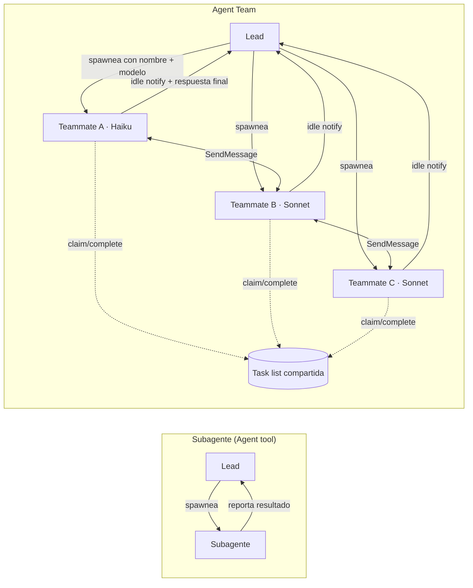
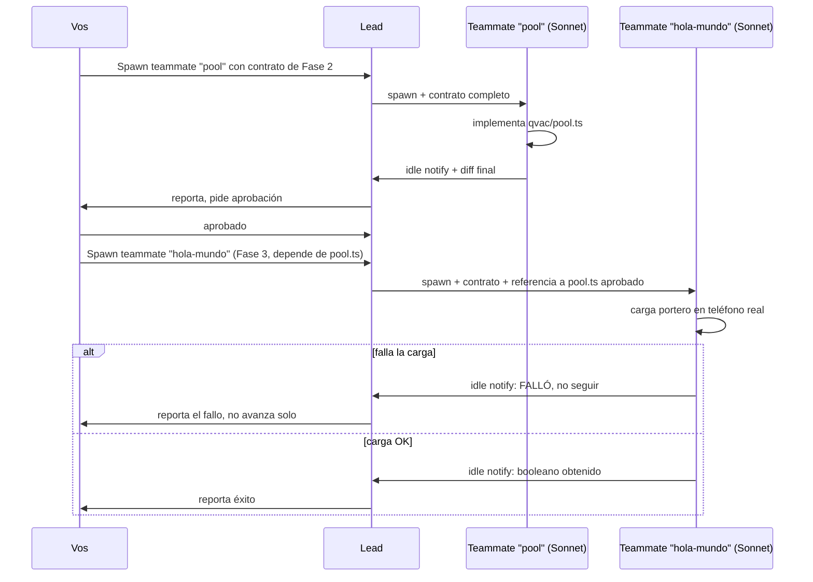

# QUÓRUM mobile — Orquestación con Agent Teams (Haiku + Sonnet)

> Solo dos modelos: **Haiku** (tareas mecánicas, acotadas, sin ambigüedad) y **Sonnet** (lógica de negocio, motor, seguridad). Nunca Opus acá — el presupuesto es de hackathon.

Usar [Agent Teams](https://code.claude.com/docs/en/agent-teams), no subagentes sueltos: los teammates comparten una task list, se coordinan solos y se mensajean directo entre ellos — que es justo el patrón de este documento (fases con dependencias, cada una con dueño de archivos).

## Activar (una sola vez, antes de spawnear nada)

```json
// .claude/settings.json del repo
{ "env": { "CLAUDE_CODE_EXPERIMENTAL_AGENT_TEAMS": "1" } }
```

Es experimental. Sin esta variable, Claude no arma equipo y cae a subagentes normales.

## Cómo se coordina el equipo (vs. subagentes sueltos)



Diferencia que importa acá: en un equipo, el teammate de la Fase 4 (`verificar.ts`) puede avisarle directo al de `precheck.ts` si encuentra una inconsistencia de contrato — no tiene que volver al lead primero.

## Flujo de una fase con dependencia (ej. Fase 2 → Fase 3)



La aprobación explícita entre fases (paso "Vos→Lead: aprobado") es manual — Agent Teams no la automatiza, y por diseño de este proyecto ningún teammate aprueba su propia fase.

## Reglas de equipo

- **3-5 teammates a la vez**, nunca más. Con 15 tareas independientes, 3 alcanza — la guía oficial lo confirma.
- El modelo se fija **en el prompt de spawn**, nombrando "Haiku" o "Sonnet" explícito por cada teammate — si no se nombra, hereda el modelo del lead (no lo dejes implícito).
- **Cada teammate es dueño de un set de archivos distinto.** Dos teammates tocando el mismo archivo = overwrite. Las fases de abajo ya están particionadas por archivo para esto.
- Los teammates no heredan el historial de esta conversación — el prompt de spawn tiene que traer el contrato completo de la tarea (que sí está en `CLAUDE.md`/`ARCHITECTURE.md`, pegalo).
- Esperá a que el equipo termine antes de seguir vos: si el lead empieza a implementar en vez de esperar, decile explícitamente que espere a los teammates.

Base: el orden de construcción de `ARCHITECTURE.md` §6, con las correcciones de `CLAUDE.md`. Cada agente recibe **solo** el contrato de su tarea + el archivo de correcciones — nunca "leé todo el doc y hacé lo que puedas".

## Regla de asignación

| Modelo | Cuándo |
|---|---|
| **Haiku** | Copiar archivo sin modificar, escribir un stub con firma ya definida, escribir un test cuando el caso ya está enumerado en una tabla, tareas con un solo resultado posible verificable mecánicamente |
| **Sonnet** | Cualquier cosa que requiera decidir, interpretar una regla de negocio, tocar `trust/reconcile.ts`, `pipeline/cruzar.ts`, `qvac/pool.ts`, o resolver una corrección de la lista de bugs sin especificación línea por línea |

Ante la duda, Sonnet. Un Haiku que reinterpreta una regla RD-0..RD-7 es más caro que el ahorro de tokens.

## Gate previo — no delegar nada hasta esto

Antes de spawnear un solo agente:
1. `npx --package "@qvac/cli" qvac doctor` — si no hay Vulkan/OpenCL, no sigas.
2. Confirmar que `WHISPER_TINY` y `QWEN3_5_0_8B_MULTIMODAL_Q4_K_M` están en `~/.qvac/models` (hoy no están — bajarlos primero).
3. Congelar `core/contracts.ts` — ningún agente de desarrollo lo toca sin que vos lo apruebes explícitamente.

## Fases y asignación

### Fase 1 — Copia (Haiku, en paralelo)
Copiar sin modificar de `apps/server/src/` a `apps/mobile/src/`:
`core/contracts.ts`, `core/ids.ts`, `trust/{normalize,similarity,entity,reconcile,score}.ts`, `policy/engine.ts`, `context/spotlight.ts`, `export/philips.ts`.

Prompt por agente: *"Copiá [archivo] de apps/server/src/[ruta] a apps/mobile/src/[misma ruta]. No cambies una línea. Si el import relativo cambia de profundidad, ajustá solo esa línea. Reportá diff."*

8 agentes Haiku, todos en paralelo, sin dependencia entre sí.

### Fase 2 — Pool de modelos (Sonnet, secuencial, depende de Fase 1 nula)
`qvac/pool.ts` — presupuesto de RAM, eviction, lock de cargas concurrentes, `assert isDelegated !== false` (corrección #5 de `CLAUDE.md`). Es la pieza que decide si el resto corre en el teléfono. Un solo agente Sonnet, sin paralelizar.

### Fase 3 — Hola mundo (Sonnet, depende de Fase 2)
Cargar el portero real en el teléfono, obtener un booleano. Si falla, el agente **para y reporta**, no improvisa un mock.

### Fase 4 — Pipeline determinista (Haiku + Sonnet mixto, en paralelo entre sí)
- `pipeline/precheck.ts` → **Sonnet** (tiene un bug conocido, corrección #1: `hayNumeros` ignorado — requiere entender por qué, no solo copiar).
- `pipeline/verificar.ts` → **Sonnet** (la regla de tolerancia de 3 palabras es sutil, corrección #11 y §Reglas de dominio de `CLAUDE.md` — un Haiku la simplifica mal, ya pasó una vez).
- `test/verificar.test.ts` → **Haiku**, una vez que `verificar.ts` está aprobado (los casos de test ya están enumerados: cita exacta, cita con tilde, cita de 2 palabras, cita fabricada).

Estos tres no dependen entre sí más que `test` de `verificar.ts`. Correr `precheck` y `verificar` en paralelo, `test` después.

### Fase 5 — Modelos con IA (Sonnet, secuencial)
`pipeline/portero.ts`, `pipeline/extractor.ts` — deciden prompts, manejo de `zVeredicto`/`zExtraccion`, y aplican las correcciones #6 (`await` de `completion()`) y #8 (`motivo.max(120)`). Nunca Haiku: son la superficie más frágil del pipeline (bug G3 de la auditoría: `extraer()` nunca definida en la fuente — hay que diseñarla, no copiarla).

### Fase 6 — Enrutador (Sonnet, depende de 4 y 5)
`pipeline/cruzar.ts` (exporta `procesarNota`). Implementar la tabla de 5 resultados con `EVIDENCIA_FABRICADA` evaluada primero (corrección de `CLAUDE.md` §Tabla de decisión). Un solo agente, con la tabla completa en el prompt, línea por línea.

### Fase 7 — Motor de quórum (Haiku para tests, Sonnet para el motor)
El motor (`reconcile.ts`) ya viene copiado de la Fase 1 sin tocar. Acá solo:
- 1 agente Sonnet revisa que las 7 reglas sigan intactas tras la copia.
- 7 agentes Haiku en paralelo, uno por regla RD-0..RD-6, escriben su test — la regla y el caso ya están en `CLAUDE.md`/doc maestro, es transcripción a test, no diseño.

### Fase 8 — Store y auditoría (Sonnet)
`store/expo-store.ts` (corrección #9 y #10: append real, filtrar línea corrupta, no vaciar) y `audit/trace.ts` (`RegistroPipeline`, ver `TRAZABILIDAD.md`). Ambos tocan persistencia — errores acá son silenciosos y caros. Sonnet, secuencial, uno primero que el otro (`trace.ts` puede citar el mismo patrón de `expo-store.ts` una vez aprobado).

### Fase 9 — UI (Haiku para las pantallas, Sonnet para la lógica de confirmación)
- Maquetación de `Capturar.tsx` y `Cliente360.tsx` (layout, estilos) → **Haiku**.
- La lógica de "confirmar / corregir / descartar" que escribe al store → **Sonnet** (es donde vive "nada se persiste sin confirmación humana").

### Fase 10 — Audio (Sonnet)
`audio/grabacion.ts` con `expo-audio` (no `expo-av`, corrección #4). Un solo agente.

## Cómo invocar (patrón, no ejecutar todavía)

Un mensaje en lenguaje natural al lead, por fase — no se arma un archivo de config por equipo, Claude lo genera solo en `~/.claude/teams/`:

```text
Spawn 8 teammates en Haiku para la Fase 1 de apps/mobile/ORQUESTACION.md:
cada uno copia un archivo distinto de apps/server/src/ a apps/mobile/src/
(misma ruta) sin cambiar una línea, salvo ajustar la profundidad del import
relativo si corresponde. Nombralos por el archivo que copian. Que reporten
diff cuando terminen.
```

Para una fase de un solo dueño (ej. Fase 2, el pool):

```text
Spawn un teammate en Sonnet llamado "pool" con este contrato completo:
[pegar la sección "Fase 2 — Pool de modelos" + la tabla de correcciones
obligatorias de CLAUDE.md que apliquen]. Que no siga a la Fase 3 sin que
yo apruebe el archivo.
```

**No lanzar la fase siguiente hasta aprobar la anterior vos mismo** — ningún teammate aprueba su propio trabajo antes de que el equipo siga. Para fases mixtas (ej. Fase 4, Haiku + Sonnet en paralelo), un solo mensaje de spawn puede nombrar el modelo de cada teammate por separado.

**Roles reutilizables (opcional):** si vas a repetir un rol seguido (ej. "escritor de tests Haiku" en las Fases 7 y 9), definilo una vez como [subagent](https://code.claude.com/docs/en/sub-agents) en `.claude/agents/` con su `model` fijo, y en el spawn decile al lead que use ese tipo — evita repetir el mismo contrato en cada prompt.

## Qué NO delegar a ningún agente, ni Haiku ni Sonnet

- Congelar o modificar `core/contracts.ts`.
- Decidir la prioridad escritorio-vs-móvil (pendiente en `ARCHITECTURE.md` §9).
- Cualquier cosa marcada `GRAVE` en `docs/AUDITORIA.md` sin que vos revises el fix antes de aceptarlo.
