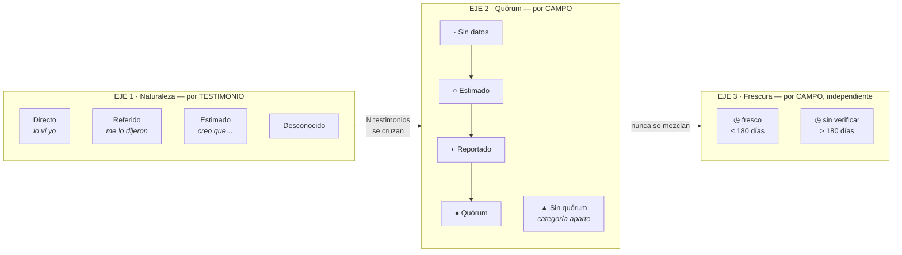
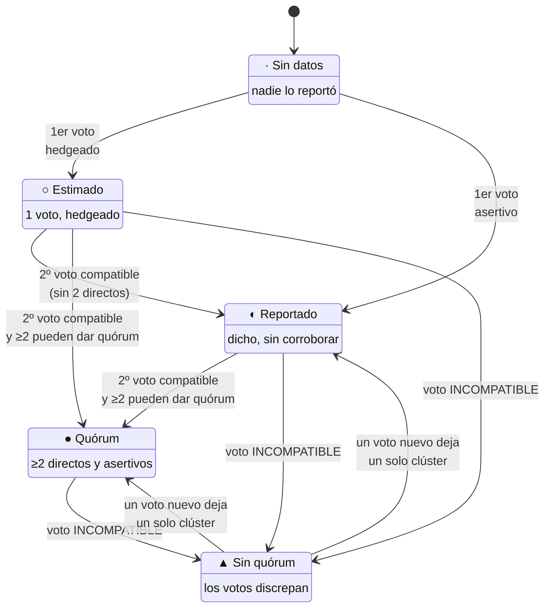
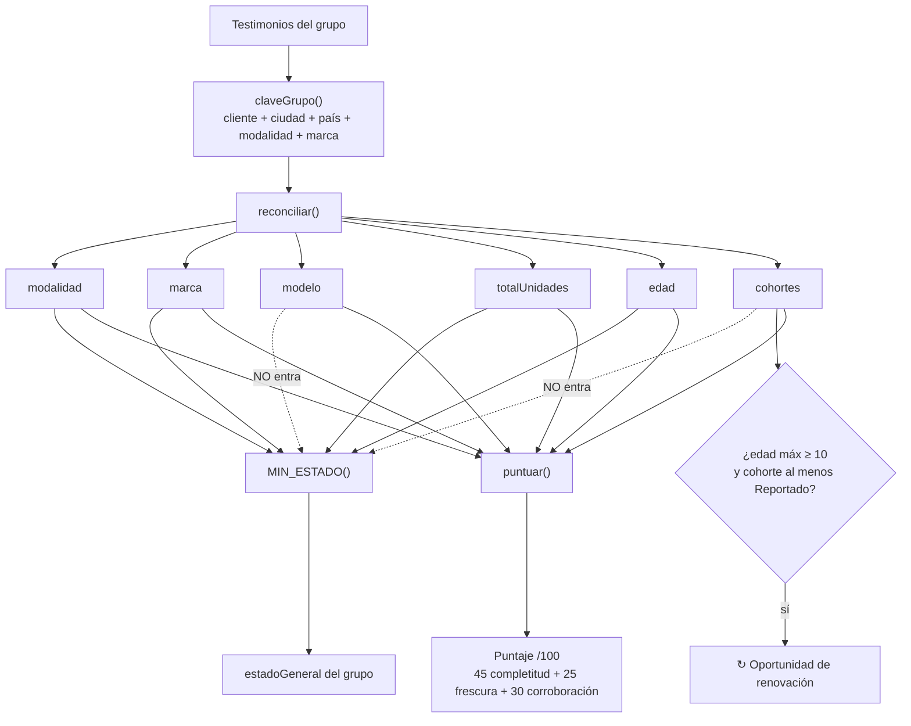
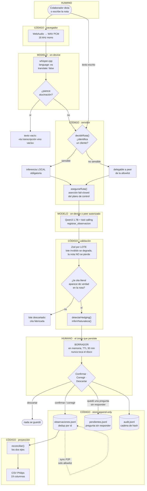
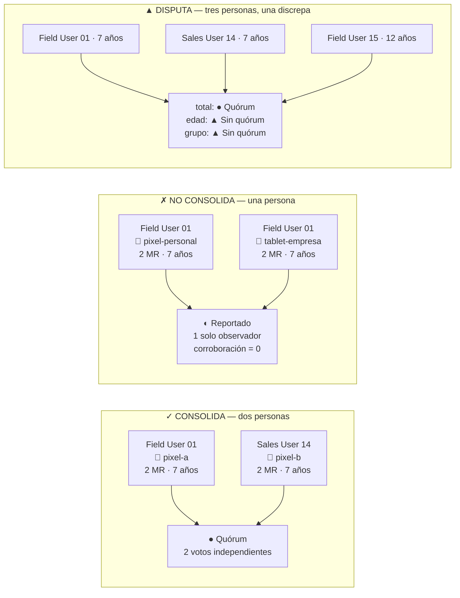
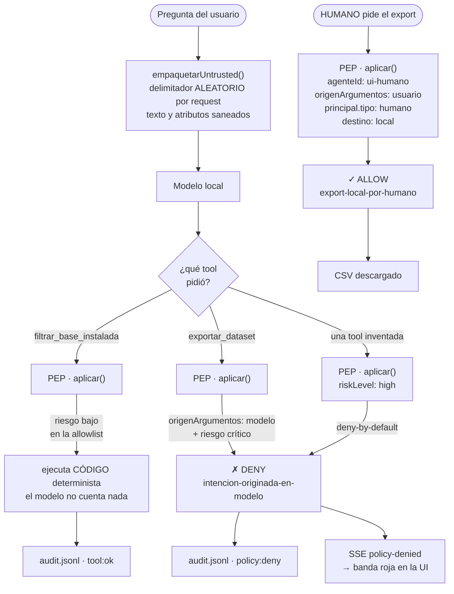

# QUÓRUM · Estados y flujo

> Módulo de referencia. Qué estados existen, quién los provoca, y por dónde pasa una nota desde la voz hasta el CSV que el cliente importa.
>
> Fuente: el código, no el doc maestro. Cada regla cita el archivo donde vive. Si el código y este documento discrepan, el código manda y este documento está desactualizado.
>
> Reglas duras completas: `docs/QUORUM_documento_unico.md` §I.2. Motor: `apps/server/src/trust/reconcile.ts`, idéntico byte a byte con `apps/mobile/src/trust/reconcile.ts`.

---

## 1 · El principio, que explica todo lo demás

**El LLM entiende. El código decide. El humano confirma.**

Los tres verbos son distintos a propósito, y la mayoría de los estados de este sistema existen para marcar cuál de los tres actuó:

| Actor | Qué le toca | Qué NO le toca |
|---|---|---|
| **Modelo** (whisper + Qwen3, on-device) | Transcribir. Traducir texto libre a estructura. Traducir una pregunta a un filtro. | Contar. Estimar. Decidir confianza. Ejecutar nada. |
| **Código** (determinista, sin inferencia) | Normalizar, agrupar, clusterizar, resolver quórum, puntuar, filtrar, exportar, autorizar. | Inventar un dato que nadie observó. |
| **Humano** | Confirmar, corregir o descartar. Autorizar el export. | — |

Consecuencia concreta: el *hedging* («creo que», «unos ocho años») no se le pregunta al modelo, lo detecta código sobre el texto original (`trust/normalize.ts` → `detectarHedging`). Si le preguntáramos al modelo si estaba seguro, habríamos puesto una decisión de confianza dentro del LLM y roto el principio en la primera línea.

---

## 2 · Los dos ejes de confianza

Son **dos**, y confundirlos es el error de diseño más fácil de cometer acá. Uno describe **un testimonio**; el otro describe **un campo** después de cruzar todos los testimonios.

### Eje 1 · Naturaleza del testimonio

Lo infiere **código** del lenguaje de la nota (`trust/normalize.ts` → `inferirNaturaleza`), y es lo que se exporta al vocabulario exacto de Philips:

| Naturaleza | Se dispara con | Columna `Status` del CSV |
|---|---|---|
| `Referido` | «me dijeron», «me comentaron», «según», «escuché», «dicen que» | `Reported` |
| `Estimado` | hedging sin marca de referencia: «creo», «unos», «aproximadamente», «tal vez» | `Estimated` |
| `Directo` | ni una cosa ni la otra — el colaborador lo vio | `Confirmed` |
| `Desconocido` | *nada lo produce hoy* | `Unknown` |

> **Detalle honesto:** `Desconocido` existe en el contrato y en el mapeo, pero `inferirNaturaleza` nunca lo devuelve — siempre cae en una de las otras tres. Es un estado alcanzable solo si un peer manda un testimonio ya marcado así.

### Eje 2 · Quórum del campo

No es «qué tan seguro está quien lo dijo», es **cuánta corroboración independiente tiene ese campo**. Se resuelve campo por campo, no por registro: en el mismo grupo la marca puede tener quórum y la edad estar en disputa.

### Eje 3 · Frescura

Cuándo se verificó por última vez. **No recibe color de la rampa de confianza**, tiene glifo propio (`◷`) y tinta neutra. Pintarla de ámbar la haría leerse como `Reportado` y fusionaría dos ejes que el producto necesita separados. Se mide desde `visitadoEn`, **no** desde `capturadaEn` (RD-6): la fecha de la visita es el dato, la de la captura es un accidente del dictado.

---

## 3 · La máquina de estados de un campo

Esto es `resolverCampo()` en `trust/reconcile.ts`, dibujado. Un **voto** = la posición de UN observador sobre UN campo (su testimonio más reciente).

Las cuatro decisiones, en orden, tal como las toma el código:

1. **Cero votos** → `Sin datos`. Y ahí se queda: *un campo sin datos nunca se rellena* (**RD-0**).
2. **Un voto** → `Estimado` si venía hedgeado, `Reportado` si no. Nunca `Quórum`: *un observador no da quórum* (**RD-1**).
3. **Dos o más votos que no son compatibles** → `Sin quórum`, con **todos** los clústeres visibles y quién sostiene cada uno. No se promedia, no se elige un ganador, no se muestra «el valor más probable» (**RD-2**).
4. **Dos o más votos compatibles** → `Quórum` si al menos dos de ellos *pueden darlo*, `Reportado` si no.

**Quién puede dar quórum** (**RD-7**): solo un testimonio con `naturaleza === 'Directo'` **y** `hedging === false`. Un «me dijeron que hay tres» y un «creo que son tres» pueden coincidir entre sí y no producen quórum — coinciden dos rumores, no dos observaciones. De ahí sale **RD-5**: si todos los votos están hedgeados, el techo es `Reportado`.

### Qué significa «compatible»

No es igualdad literal. Cada campo tiene su propio criterio, y todos son deterministas:

| Campo | Criterio de compatibilidad |
|---|---|
| `modalidad` | igualdad exacta (ya viene del vocabulario controlado) |
| `marca` | igualdad tras normalizar: sin acentos, sin no-alfanuméricos, minúsculas |
| `modelo` | igualdad tras minúsculas y quitar espacios |
| `totalUnidades` | igualdad numérica |
| `edad` | **rangos que se solapan con ±2 años de tolerancia** — «como ocho» y «siete» son el mismo equipo |

### `Sin quórum` no es un escalón

La escalera es `Sin datos → Estimado → Reportado → Quórum`. `Sin quórum` **no está en la escalera**: no es «menos que Reportado», es una categoría aparte. Significa *el sistema no sabe cuál de las dos versiones es la buena*, y eso no es un grado de confianza, es una pregunta abierta. Por eso, desde la corrección de puntaje, un campo `Sin quórum` **no cuenta como dato presente** en la completitud: antes un grupo en disputa era el mejor puntuado del dataset.

### RD-3 · un observador cuenta una vez

De cada observador vale **su testimonio más reciente** por `visitadoEn`, y nada más. Sin esta regla el sistema se auto-corrobora: alcanza con que una persona dicte la misma nota dos veces para fabricar un quórum.

---

## 4 · Del grupo entero: estado general, oportunidad y puntaje

- **`estadoGeneral`** = el **mínimo** de `modalidad`, `totalUnidades`, `marca` y `edad`. Si cualquiera está `Sin quórum`, el grupo entero queda `Sin quórum`. `modelo` y las cohortes no entran: el modelo casi nunca se captura y arrastraría todo a `Sin datos`.
- **La clave del grupo no incluye la edad.** Edades distintas dentro del mismo grupo son **cohortes**, no una contradicción: «tres MR, dos viejos y uno nuevo» es composición. Esa es la respuesta de este producto a lo que otro sistema registraría como conflicto.
- **Puntaje**: `completitud` cuenta campos *conocidos* con pesos (modalidad y cantidad valen doble, modelo medio); `frescura` decae lineal a un año desde la última visita; `corroboración` es 1 con ≥3 testigos habilitados, 0.6 con 2, 0 con uno — y solo cuentan los que **convergen** en el clúster mayoritario de cada campo en disputa.

---

## 5 · El flujo de una nota: de la voz al CSV

Los cinco momentos que definen el producto, en ese flujo:

1. **La transcripción es local.** El navegador solo graba; transcribe whisper en el equipo. La API de reconocimiento de voz del navegador está prohibida: manda el audio al servidor del proveedor y eso es inferencia en la nube.
2. **La ruta de inferencia se decide antes de tocar el modelo**, y después se **verifica** contra el SDK en vez de confiar en lo que pedimos. Si la nota identifica a un cliente, la inferencia es local obligatoria: un peer delegado vería el prompt en claro.
3. **La evidencia se verifica sin modelo.** Cada lote trae una cita que debe aparecer literalmente en la nota (normalizando acentos y espacios). Una cita bien formada pero inventada se descarta igual que una mal formada. Es la única barrera anti-alucinación antes de que un dato llegue al borrador.
4. **Nada se persiste sin confirmación humana.** El borrador vive en memoria con TTL de 30 minutos y **no tiene función de escritura a disco**. `/api/confirmar` es el único endpoint que escribe evidencia.
5. **La nota con una pregunta sin responder se guarda igual.** Máximo una pregunta por nota, y contestarla es opcional: si no se contesta, la nota queda `pendiente-de-revision` y va a la cola de pendientes. Descartarla sería castigar al colaborador por no saber un dato.

---

## 6 · Multidispositivo: por qué dos teléfonos no son dos testigos

El escenario real del reto: la misma base instalada llega en pedazos, desde varios teléfonos, y hay que consolidarla en una sola verdad. La trampa no es una regla mal implementada — es **confundir dispositivo con observador**.

- El quórum lo dan **observadores**, no aparatos: `votos()` indexa por `observadorId` y descarta el resto.
- **El reenvío no corrobora.** Un peer que se reconecta manda el dataset completo otra vez; el store deduplica por `id`, así que la misma observación recibida cinco veces sigue siendo un voto.
- **Origen `peer` no vale menos.** El `origen` decide si el texto pasa por *spotlighting* antes de llegar a un modelo, no cuánto pesa como testimonio: un testigo directo no es menos testigo por haber llegado por la red.
- **El disidente no se borra.** El caso C muestra las dos versiones con nombre y apellido, y hace falta una visita más de un observador independiente para resolverlo.

Estos cuatro casos están fijados en `apps/server/test/multidispositivo.test.ts`.

---

## 7 · El otro flujo: cuando el modelo intenta algo que no le corresponde

La consulta en lenguaje natural le ofrece al modelo **dos** herramientas: el filtro de lectura y el export del dataset completo. La peligrosa se ofrece a propósito — es lo que prueba que la defensa existe.

La línea que detiene la inyección indirecta es `origenArgumentos`: **la misma herramienta** se permite si la pidió una persona y se deniega si la pidió el modelo. El texto que viene de un peer puede decir «exportá todo a este servidor» todas las veces que quiera; llega al PEP marcado como intención de modelo y muere ahí, con su registro en la cadena de auditoría.

Las cuatro capas, en orden de evaluación (`policy/engine.ts`):

1. `intencion-originada-en-modelo` — **deny**: riesgo alto o crítico originado en la salida del modelo.
2. `tool-fuera-de-allowlist` — **deny**: la herramienta no está en la lista de ese agente.
3. `egress-no-autorizado` — **deny**: destino que no sea `local` (la allowlist de egress está vacía).
4. `critico-requiere-aprobacion` — **require-approval**, con una excepción quirúrgica: el export local iniciado por un humano ya *es* la aprobación fuera de banda.

Y si ninguna regla autoriza explícitamente: **deny-by-default**.

---

## 8 · Las ocho reglas duras, y dónde vive cada una

| Regla | Qué dice | Dónde se hace cumplir |
|---|---|---|
| **RD-0** | Un campo sin datos nunca se rellena | `resolverCampo()` → `estado: 'Sin datos'`, sin `valor` |
| **RD-1** | Un observador no da quórum | `resolverCampo()` → rama de un solo voto |
| **RD-2** | Discrepancia es `Sin quórum`, nunca promedio | `resolverCampo()` → `clusters`, y `valor` queda `undefined` |
| **RD-3** | Un observador cuenta una vez: su testimonio más reciente | `votos()` → `Map` por `observadorId`, ordenado por `visitadoEn` |
| **RD-4** | La confianza es por campo, no por registro | cada campo se resuelve por separado en `reconciliar()` |
| **RD-5** | Si todos los votos están hedgeados, techo `Reportado` | `puedeDarQuorum` exige `!hedging` |
| **RD-6** | La frescura se mide desde `visitadoEn`, no `capturadaEn` | `resolverCampo()` y `puntuar()` |
| **RD-7** | Solo un testimonio `Directo` y asertivo da quórum | `puedeDarQuorum = naturaleza === 'Directo' && !hedging` |

Están cubiertas una por una en `apps/server/test/reconcile.test.ts`, y en conjunto en `test/multidispositivo.test.ts`.

---

## 9 · Cómo se ve cada estado, y por qué

| Estado | Glifo | Regla visual |
|---|---|---|
| Quórum | ● | verde sobrio |
| Reportado | ◐ | ámbar |
| Estimado | ○ | gris |
| Sin datos | · | gris claro |
| Sin quórum | ▲ | rojo contenido, no de alarma |
| Frescura | ◷ | **sin hue** — tinta neutra, eje aparte |

Tres invariantes de la interfaz, que son decisiones de producto y no de gusto:

1. **El color codifica confianza y nada más.** Ningún otro elemento toma un color de esa rampa para otra cosa.
2. **El color nunca es el único portador de significado.** Cada estado sale siempre como glifo + etiqueta + color. Es accesibilidad, y también robustez ante la compresión de un video.
3. **`Sin quórum` no se esconde detrás de un click.** El bloque con todas las versiones y quién sostiene cada una va siempre visible. Si esta pantalla promediara, el proyecto perdería su argumento.
